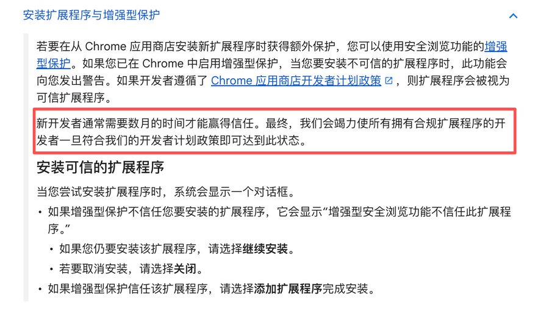

# X 推荐检查器

## 功能

- 自动获取并解析 X 官方算法标签报告。
- 展示账号和帖子命中的限流标签。
- 数据仅在本机处理。

## 安装

### 直接安装

打开 [Chrome 网上应用店中的 X 推荐检查器](https://chromewebstore.google.com/detail/kjjngpkamojflohheakdkngmbllenlic?utm_source=item-share-cb)，点击“添加至 Chrome”。

### 搜索安装

1. 打开 [Chrome 网上应用店](https://chromewebstore.google.com/?hl=zh-CN)。
2. 搜索完整名称 `X 推荐检查器`。
3. 选择名称完全一致、图标为黑底 X 与放大镜的扩展。
4. 点击“添加至 Chrome”并确认安装。

### 关于“继续操作有风险”提示

部分开启“增强型安全浏览”的用户可能会看到“增强型安全浏览功能不信任此扩展程序”的提示。这是 Chrome 针对新开发者的信誉保护机制，不表示扩展被检测出安全问题。本扩展已通过 Chrome 网上应用店审核；请确认正在访问上方官方商店链接，然后点击“继续安装”。无需关闭安全浏览功能。

参考：[Google Chrome 官方说明](https://support.google.com/chrome/answer/2664769?hl=zh-CN)

## 作者

- [web3渔夫](https://x.com/web3_fising)
- [币圈老司机🔶BNB](https://x.com/Bqlsj2023)
